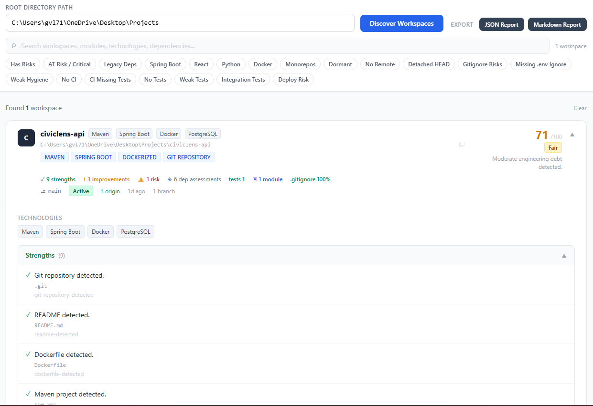
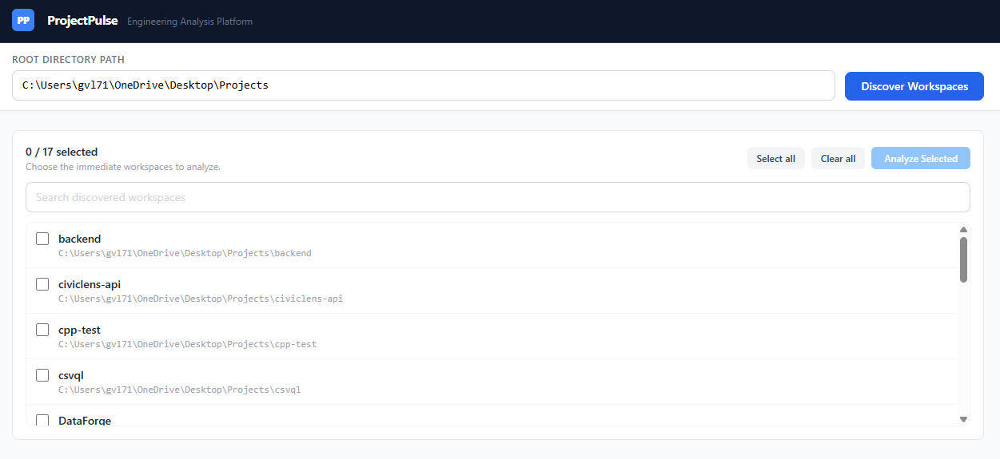
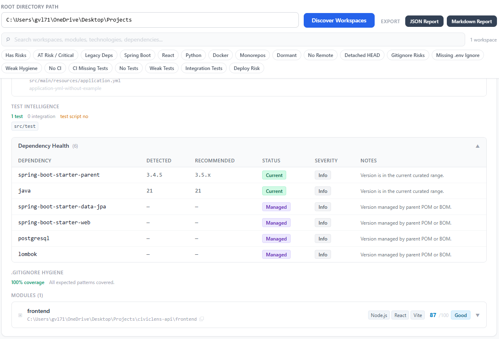
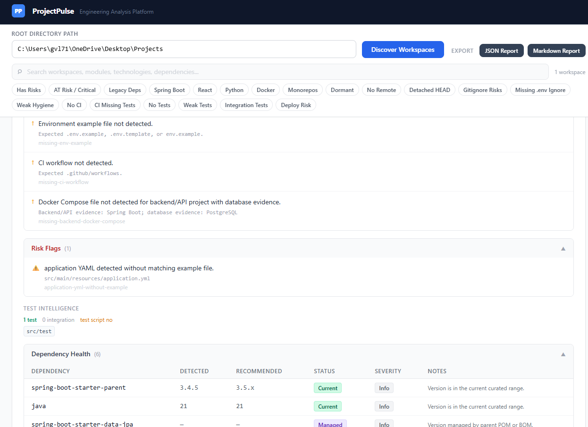

# ProjectPulse

**Engineering Intelligence Platform for Repository Health Analysis**

ProjectPulse is a full-stack engineering analysis platform that inspects software repositories and surfaces actionable health signals across architecture, dependencies, testing, CI posture, Git activity, repository hygiene, and engineering risk.

Built as a production-style portfolio project to demonstrate backend engineering, frontend product design, systems thinking, and static code intelligence.

**Live Demo:** https://projectpulse.pulse-forge.com



---

## What It Does

ProjectPulse performs **read-only engineering analysis** against selected software projects and answers questions like:

- Is this project actively maintained?
- Are dependencies healthy or outdated?
- Does CI exist?
- Are automated tests actually present?
- Is repository hygiene acceptable?
- Are there obvious engineering risks?
- Is this codebase likely healthy, neglected, or risky?

Instead of manually inspecting repositories one by one, ProjectPulse provides a fast engineering intelligence dashboard.

---

## Core Features

## Workspace Discovery & Selective Analysis

Analyze only the repositories you care about.

ProjectPulse discovers immediate workspaces under a root directory and lets you selectively choose targets before analysis.

Benefits:

- avoids wasting compute
- reduces scan noise
- improves UX
- supports large project directories



---

## Engineering Health Scoring

Deterministic health scoring with engineering posture tiers:

| Score Tier | Meaning |
|---------|---------|
| EXCELLENT | Strong engineering posture |
| GOOD | Healthy with minor improvements |
| FAIR | Moderate engineering debt |
| AT_RISK | Significant engineering concerns |
| CRITICAL | Serious technical risk |

Scoring considers:

- strengths
- improvements
- risk findings
- dependency health
- test maturity
- CI posture
- Git activity
- repository hygiene

---

## Dependency Intelligence

Analyzes dependency manifests and version posture.

Supported ecosystems:

### Java / Spring
- Maven
- Spring Boot
- Java runtime detection
- managed dependency awareness (BOM/POM)

### Frontend / Node
- npm
- React
- TypeScript
- Vite
- frontend dependency analysis

### Python
- requirements.txt
- pytest ecosystem awareness

Dependency health classifications:

- CURRENT
- UPGRADE_CANDIDATE
- LEGACY
- CRITICAL
- UNKNOWN
- MANAGED



---

## Git Intelligence

Repository-level engineering visibility:

- Git repository detection
- active branch
- detached HEAD detection
- remote repository presence
- branch count
- commit recency
- activity classification

Activity states:

- ACTIVE
- QUIET
- STALE
- DORMANT

---

## CI Workflow Intelligence

Static analysis of GitHub Actions workflows.

Detects:

- workflow presence
- pull request validation
- push triggers
- manual workflow dispatch
- build jobs
- test jobs
- deploy jobs
- toolchain signals

Risk detection includes:

- deploy workflows without manual gating
- CI present without tests
- missing CI for production-style repositories

---

## Test Intelligence

ProjectPulse detects **real test maturity**, not just whether a folder exists.

Supported frameworks:

### Java
- JUnit
- SpringBootTest
- Mockito
- integration test detection

### JavaScript / TypeScript
- Jest
- Vitest
- React Testing Library
- Cypress
- Playwright

### Python
- pytest
- unittest

### C++
- GoogleTest
- Catch2
- doctest

Signals include:

- test file count
- framework detection
- integration tests
- test script presence

---

## Repository Hygiene Intelligence

Evaluates `.gitignore` quality and repository cleanliness.

Detects missing exclusions such as:

- build artifacts
- dependency directories
- IDE junk
- virtual environments
- environment secrets
- compiled binaries

Examples:

- `.env` not ignored
- `node_modules` committed risk
- compiled executable artifacts present

---

## Risk Detection

ProjectPulse surfaces actionable engineering concerns.

Examples:

- missing CI workflows
- missing environment example files
- application config exposure
- Docker orchestration gaps
- compiled binary artifacts
- weak repository hygiene
- lack of tests



---

## Ad Hoc / Unknown Project Support

Not every project has a clean manifest.

ProjectPulse handles:

- loose C++ folders
- source-only utilities
- experimental projects
- ad hoc engineering workspaces

Selected workspaces never silently disappear just because detection heuristics fail.

---

## Reporting

Export scan results as:

- JSON
- Markdown

Useful for:

- engineering reviews
- repository audits
- technical documentation
- architecture discussions

---

## Architecture

## Backend

**Java 21 + Spring Boot**

Responsibilities:

- workspace discovery
- repository scanning
- scoring engine
- dependency parsing
- Git analysis
- CI workflow parsing
- test intelligence
- repository hygiene analysis
- report generation

---

## Frontend

**React + TypeScript + Vite + Tailwind CSS**

Responsibilities:

- workspace discovery UX
- selective analysis workflow
- filtering
- dashboard presentation
- engineering signal visualization
- report export

---

## Tech Stack

### Backend
- Java 21
- Spring Boot
- Maven

### Frontend
- React
- TypeScript
- Vite
- Tailwind CSS
- Axios

---

## Quick Start

### Backend

```bash
cd backend
mvn spring-boot:run
````

### Frontend

```bash
cd frontend
npm install
npm run dev
```

Open:

```text
http://localhost:5173
```

**Windows convenience:** `start-dev.ps1` launches both the backend and frontend dev servers in separate windows.

**Production deployment:** The repository also includes `docker-compose.yml` for the deployed instance. It is shaped for the production server, runs behind a Caddy reverse proxy serving HTTPS, mounts a server-specific `/opt/apps` path, and does not publish host ports. Treat it as the deployment configuration, not a portable local-run method.

---

## Design Principles

ProjectPulse intentionally follows strict constraints:

* Read-only analysis
* No modification of scanned repositories
* No build execution against scanned projects
* No test execution against scanned projects
* Deterministic scoring
* Fast engineering feedback

---

## Roadmap

Planned enhancements:

* historical scan comparisons
* architecture smell detection
* Docker intelligence
* dependency vulnerability analysis
* richer heuristics
* AI-assisted engineering recommendations

See:

```text
ROADMAP.md
```

---

## Why This Project Matters

This project demonstrates:

* backend engineering
* API design
* static analysis heuristics
* systems thinking
* scoring engine design
* frontend product UX
* engineering tooling design

This is intentionally **not another CRUD portfolio app**.

---

## Author

**Gregory Luna**

Built as a serious engineering portfolio project.

```


